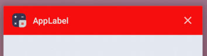
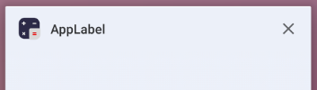
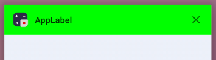

  
  # react-native-task-description &middot; [](https://github.com/moh3n9595/react-native-task-description/blob/master/LICENSE) [](https://github.com/moh3n9595/react-native-task-description/compare)


<p align="center">
  <div align="center">
    
    
    
  </div>
  <br>
  <p align="center">
    Android Task Description
  </p>
</p>

## Getting started

`$ npm i react-native-task-description`

### Mostly automatic installation (RN < 60)

`$ react-native link react-native-task-description`

### Manual installation (RN < 60)

#### Android

1. Open up `android/app/src/main/java/com/moh3n95/taskDescription/MainActivity.java`
  - Add `import com.moh3n95.taskDescription.RNTaskDescriptionPackage;` to the imports at the top of the file
  - Add `new RNTaskDescriptionPackage()` to the list returned by the `getPackages()` method
2. Append the following lines to `android/settings.gradle`:
  	```
  	include ':react-native-task-description'
  	project(':react-native-task-description').projectDir = new File(rootProject.projectDir, '../node_modules/react-native-task-description/android')
  	```
3. Insert the following lines inside the dependencies block in `android/app/build.gradle`:
  	```
      compile project(':react-native-task-description')
  	```

## Usage
```javascript
import setTaskDescription from 'react-native-task-description';

setTaskDescription({
  color: "red",
  label: "AppLabel"
})

```

## Contributing

Thank you for your interest in contributing! Please feel free to put up a PR for any issue or feature request.

## Give me a Star

If you think this project is helpful just give me a ⭐️ Star is enough because i don't drink coffee 😃

## License

This project is licensed under the MIT License - see the [LICENSE.md](https://github.com/moh3n9595/react-native-task-description/blob/master/LICENSE) file for details

## Author

Made with ❤️ by [Mohsen Madani](https://github.com/moh3n9595).